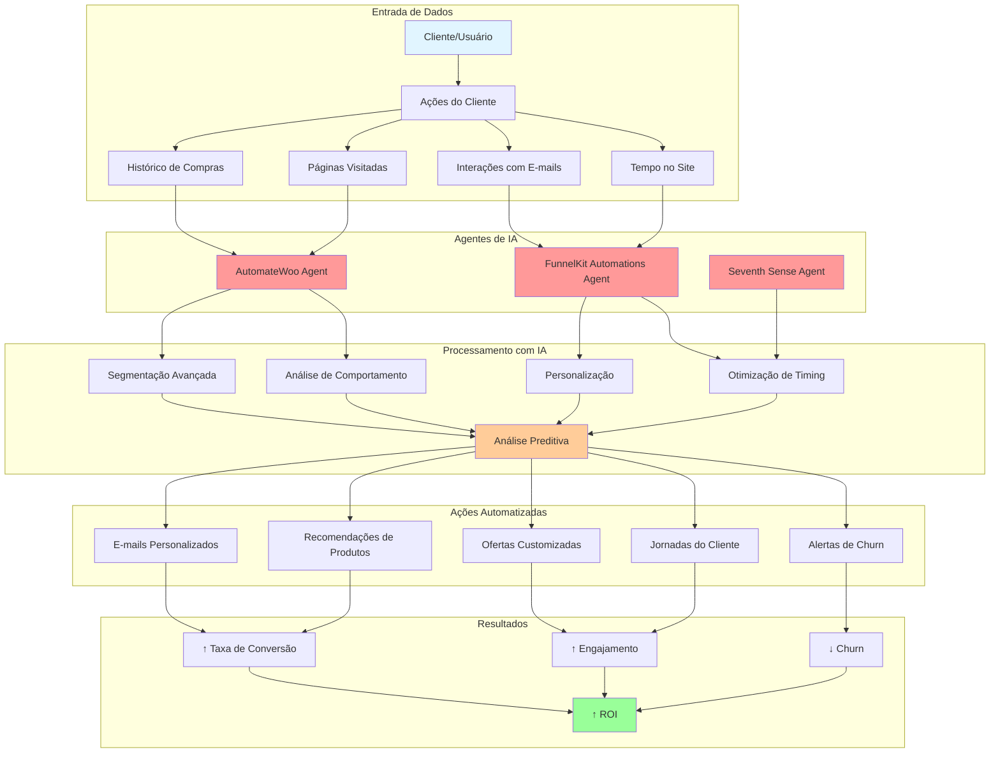
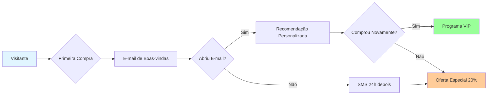
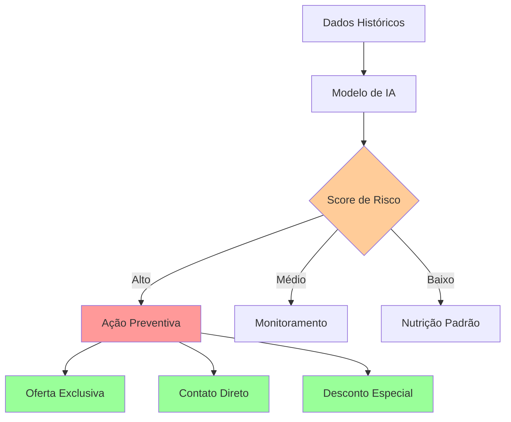
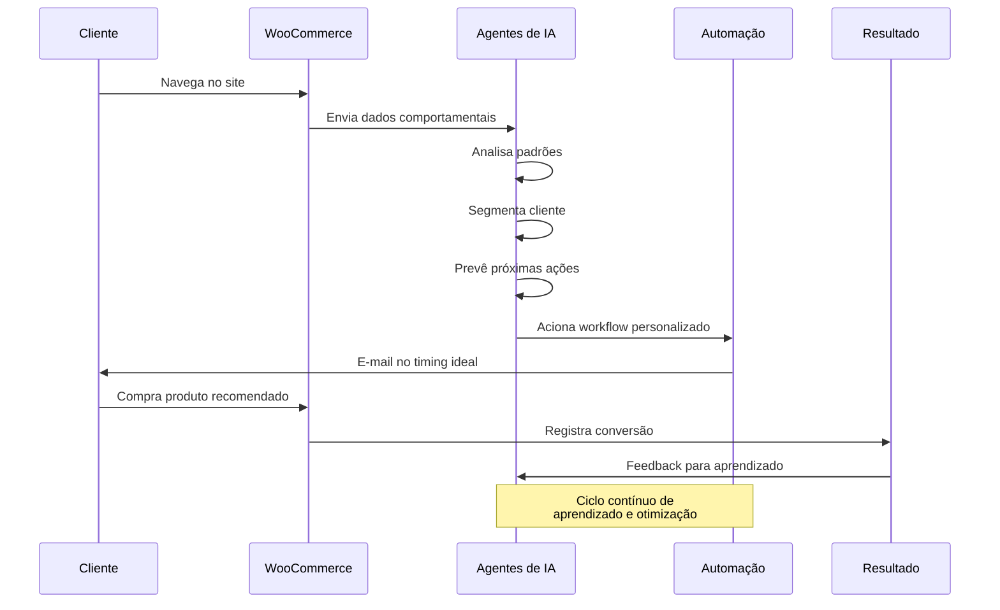
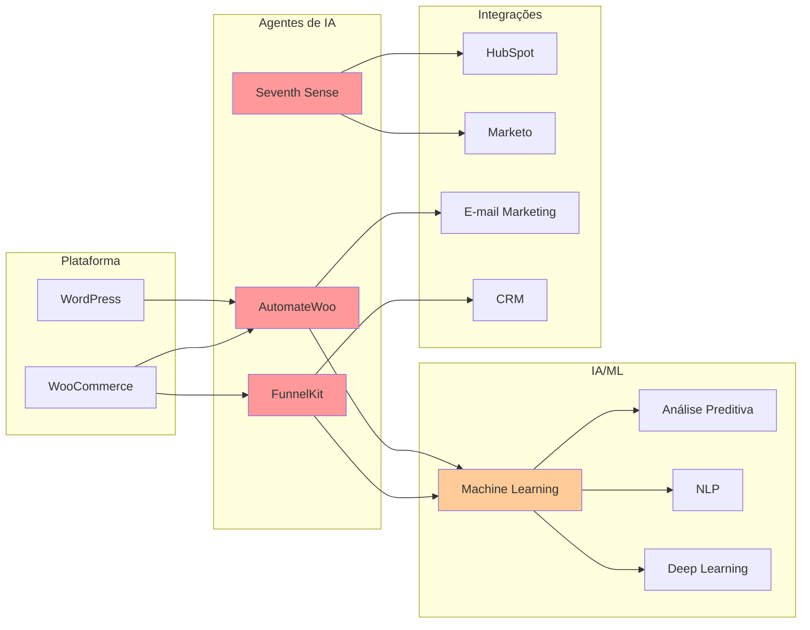

# 🤖 Agentes de IA para Automação de Marketing e E-commerce

## Apresentação para Podcast - Automação & IA

---

## 📊 Diagrama da Arquitetura dos Agentes



---

## 🎯 Visão Geral dos Agentes

### **AutomateWoo & FunnelKit Automations**
Agentes de IA especializados em automação de marketing para WordPress e WooCommerce

### **Integração: Seventh Sense**
Otimização de timing com IA para plataformas como HubSpot e Marketo

---

## 🧠 Capacidades dos Agentes de IA

### 1. **Segmentação Avançada** 🎯

**O que faz:**
- Analisa o comportamento do cliente em tempo real
- Processa histórico de compras e navegação
- Cria segmentos dinâmicos e automáticos

**Vantagem sobre segmentação manual:**
- ✅ Identifica padrões invisíveis ao olho humano
- ✅ Atualização contínua dos segmentos
- ✅ Milhares de variáveis analisadas simultaneamente

**Exemplo prático:**
```
Cliente A: Comprou 3x em eletrônicos, visita às terças, abre e-mails à noite
→ Segmento: "Tech Enthusiast - Engajamento Noturno"
→ Ação: E-mails de novos produtos enviados terças às 20h
```

---

### 2. **Personalização Inteligente** 💎

**O que faz:**
- Cria jornadas únicas para cada cliente
- Adapta mensagens ao contexto individual
- Recomenda produtos com base em IA

**Componentes:**
- **Mensagens personalizadas**: Nome, histórico, preferências
- **Ofertas customizadas**: Descontos baseados em comportamento
- **Recomendações**: Machine Learning identifica produtos relevantes

**Exemplo de Jornada:**


---

### 3. **Otimização de Timing** ⏰

**O que faz:**
- Determina o melhor momento para cada ação
- Analisa padrões de abertura de e-mails
- Maximiza taxas de conversão

**Como funciona (Seventh Sense):**
```
Análise de Dados → Padrões Individuais → Envio Otimizado
```

**Resultados típicos:**
- 📈 **+25-40%** em taxas de abertura
- 📈 **+15-30%** em cliques
- 📈 **+10-20%** em conversões

**Exemplo:**
- Cliente 1: Engaja mais segundas às 8h → E-mails enviados segundas 7:45h
- Cliente 2: Engaja mais sextas às 21h → E-mails enviados sextas 20:30h

---

### 4. **Análise Preditiva** 🔮

**O que prevê:**

#### **Risco de Churn (Cancelamento)**


#### **Outros Padrões Previstos:**
- 🔄 Probabilidade de recompra
- 💰 Valor vitalício do cliente (LTV)
- 📦 Produtos que o cliente comprará em seguida
- 📅 Melhor momento para upsell/cross-sell

---

## 🏗️ Fluxo de Trabalho Completo



---

## 📈 Casos de Uso Práticos

### **Caso 1: Recuperação de Carrinho Abandonado**
```
Situação: Cliente adiciona produto mas não finaliza compra

Agente IA detecta:
→ Produto de alto interesse
→ Cliente tem histórico de compras
→ Melhor horário de engajamento: 19h

Ação automatizada:
→ E-mail 1h depois com desconto de 10%
→ Se não abrir: SMS no dia seguinte
→ Se não converter: Remarketing com 15% off

Resultado: +35% de recuperação vs. abordagem manual
```

### **Caso 2: Prevenção de Churn**
```
IA detecta sinais:
✗ Sem compras há 60 dias
✗ Parou de abrir e-mails
✗ Diminuiu visitas ao site
→ Score de risco: 85%

Ação preventiva:
→ E-mail VIP com oferta exclusiva
→ Cupom de 20% válido por 7 dias
→ Mensagem personalizada do time

Resultado: 40% dos clientes em risco reativados
```

### **Caso 3: Upsell Inteligente**
```
Cliente comprou: Câmera DSLR

IA analisa:
→ Padrão: 70% compram acessórios em 2 semanas
→ Produtos complementares: Lente, tripé, bag
→ Melhor timing: 3 dias após entrega

Ação:
→ E-mail com bundle personalizado
→ Desconto progressivo (compre 2+ itens)
→ Frete grátis

Resultado: +50% em valor médio do pedido
```

---

## 💡 Benefícios Mensuráveis

### **Eficiência Operacional**
- ⏱️ **90% menos tempo** em segmentação manual
- 🤖 **24/7** de operação autônoma
- 📊 **10x mais** variáveis analisadas

### **Performance de Marketing**
- 📧 **+40%** em taxas de abertura
- 🎯 **+60%** em relevância das ofertas
- 💰 **+35%** em conversão

### **Retenção de Clientes**
- 🔄 **+45%** em recompra
- ❤️ **+30%** em satisfação
- 📉 **-50%** em churn

### **ROI**
- 💵 Retorno médio: **5-10x** o investimento
- 📈 Payback: **2-4 meses**

---

## 🔧 Tecnologias Envolvidas



---

## 🚀 Por Que Isso Importa?

### **O Futuro do E-commerce é Agêntico**

1. **Escalabilidade**: Impossível fazer manualmente o que a IA faz
2. **Precisão**: Decisões baseadas em dados, não intuição
3. **Velocidade**: Reação em tempo real às ações do cliente
4. **Aprendizado**: Melhora contínua sem intervenção humana

### **Diferencial Competitivo**

Empresas usando agentes de IA:
- ✅ Respondem instantaneamente ao comportamento do cliente
- ✅ Oferecem experiências verdadeiramente personalizadas
- ✅ Preveem e previnem problemas antes que aconteçam
- ✅ Operam 24/7 sem custos adicionais

---

## 🎬 Conclusão

**Agentes de IA em automação de marketing não são o futuro - são o presente.**

### Key Takeaways:
1. 🧠 **IA analisa milhares de variáveis** que humanos não conseguem processar
2. ⚡ **Automação inteligente** = timing perfeito + mensagem certa + pessoa certa
3. 📈 **ROI comprovado** com métricas mensuráveis
4. 🔄 **Aprendizado contínuo** torna o sistema melhor a cada interação

### Próximos Passos:
- Avaliar ferramentas para seu negócio
- Começar com um caso de uso específico
- Medir resultados e iterar
- Escalar conforme o sucesso

---

## 📚 Recursos Adicionais

- **AutomateWoo**: https://automatewoo.com
- **FunnelKit Automations**: https://funnelkit.com
- **Seventh Sense**: https://www.theseventhsense.com

---

**Preparado para revolucionar sua automação com IA?** 🚀

*Dúvidas? Vamos discutir nos comentários!*
